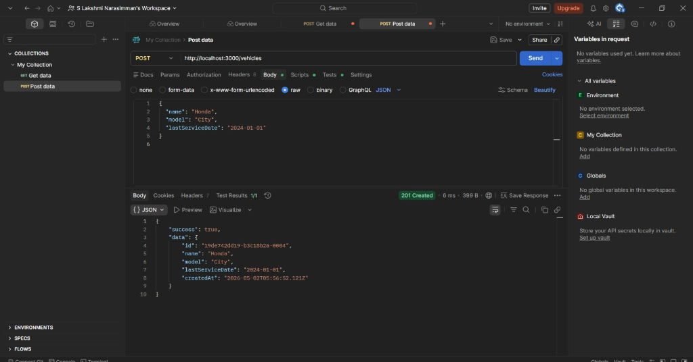
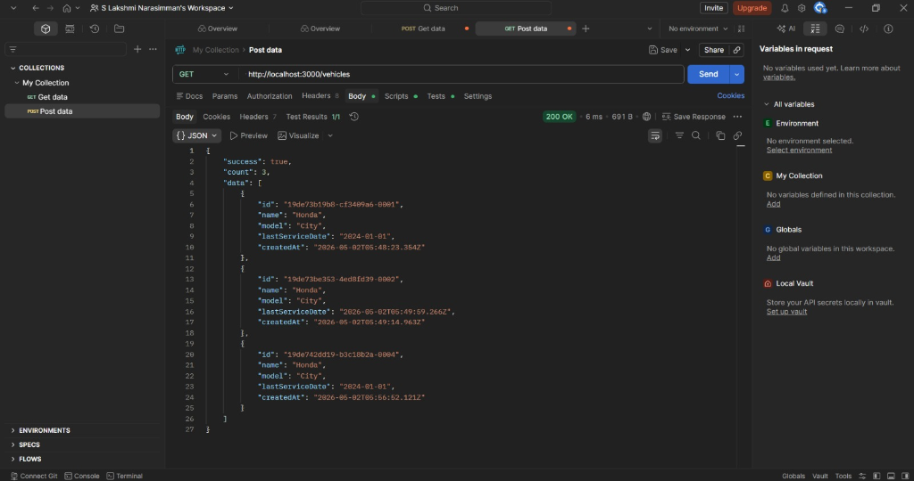
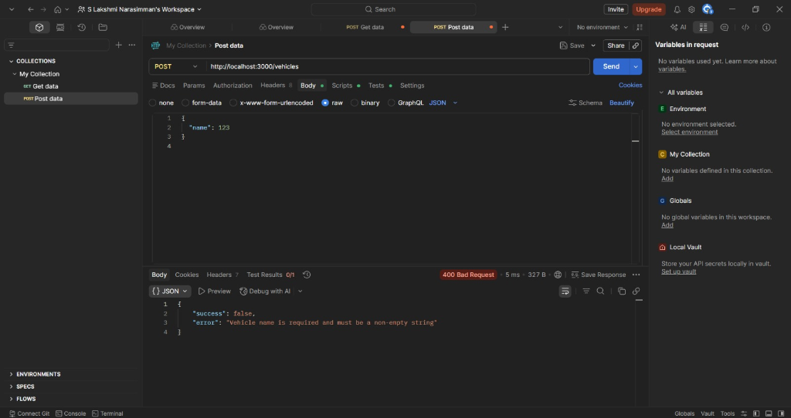
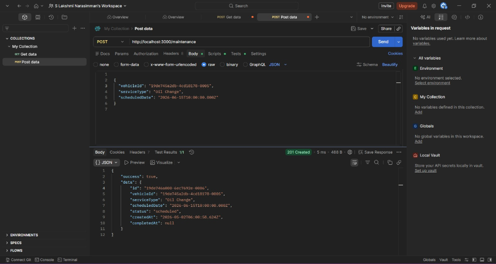
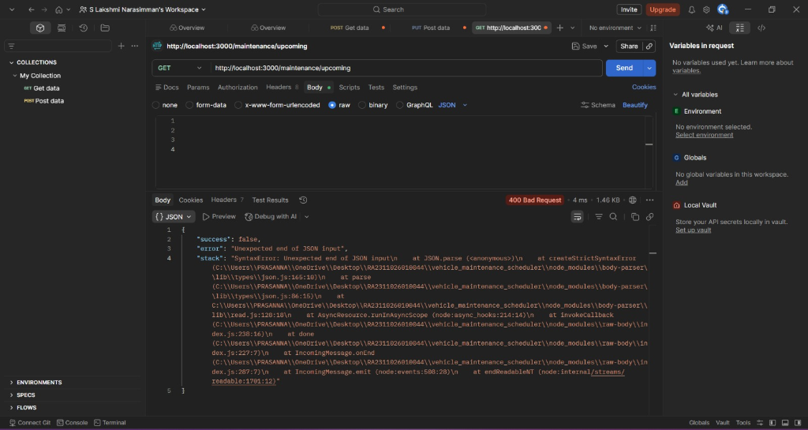
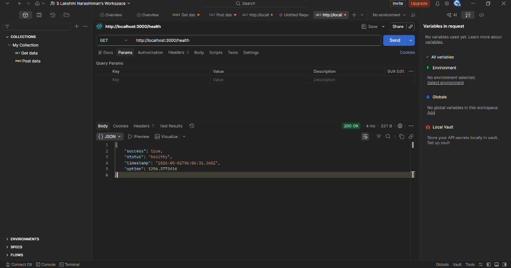

# Backend Evaluation System

> Production-grade Node.js + Express backend with reusable logging middleware, vehicle maintenance scheduler, and authentication integration.

---

## 📁 Project Structure

```
RA2311026010044/
├── logging_middleware/              # Reusable logging package
│   ├── index.js                     # Public API
│   ├── logger.js                    # Core Log() function
│   ├── constants.js                 # Allowed values & validation
│   └── package.json
│
├── vehicle_maintenance_scheduler/   # Main application service
│   ├── src/
│   │   ├── config/index.js          # Environment config
│   │   ├── controllers/             # Request handlers
│   │   ├── middleware/              # Error & request logging
│   │   ├── repositories/           # Data access layer
│   │   ├── routes/                  # API route definitions
│   │   ├── services/               # Business logic
│   │   └── utils/                  # Helpers (ID generator)
│   ├── app.js                       # Express app setup
│   ├── server.js                    # Entry point
│   ├── .env.example                 # Environment template
│   └── package.json
│
├── notification_app_be/             # Auth scripts
│   ├── src/
│   │   ├── auth/
│   │   │   ├── register.js          # Registration script
│   │   │   └── getToken.js          # Token retrieval script
│   │   └── config/index.js
│   ├── .env.example
│   └── package.json
│
├── notification_system_design.md    # System design document
├── .gitignore
└── README.md
```

---

## 🚀 Quick Start

### Prerequisites

- **Node.js** v18+ installed
- **npm** (comes with Node.js)

### 1. Clone and Install

```bash
cd RA2311026010044

# Install vehicle maintenance scheduler dependencies
cd vehicle_maintenance_scheduler
npm install

# Install notification app dependencies
cd ../notification_app_be
npm install
```

### 2. Configure Environment

```bash
# Vehicle Maintenance Scheduler
cd vehicle_maintenance_scheduler
cp .env.example .env
# Edit .env and fill in ACCESS_TOKEN

# Notification App BE
cd ../notification_app_be
cp .env.example .env
# Edit .env and fill in registration details
```

### 3. Register & Get Token (One-time)

```bash
cd notification_app_be

# Step 1: Register (fill .env with your details first)
npm run register
# → Save the returned CLIENT_ID and CLIENT_SECRET to .env

# Step 2: Get auth token
npm run get-token
# → Save the returned ACCESS_TOKEN to .env
# → Also add it to vehicle_maintenance_scheduler/.env
```

### 4. Start the Server

```bash
cd vehicle_maintenance_scheduler
npm start
```

The server will start on `http://localhost:3000`.

---

## 📡 API Endpoints

### Health Check

```
GET /health
```

### Vehicles

| Method | Endpoint     | Description       |
|--------|-------------|-------------------|
| POST   | `/vehicles` | Create a vehicle  |
| GET    | `/vehicles` | List all vehicles |

#### Create Vehicle

```bash
curl -X POST http://localhost:3000/vehicles \
  -H "Content-Type: application/json" \
  -d '{
    "name": "Toyota Camry",
    "model": "2024 XLE",
    "lastServiceDate": "2025-12-15T00:00:00.000Z"
  }'
```

#### List Vehicles

```bash
curl http://localhost:3000/vehicles
```

### Maintenance

| Method | Endpoint                       | Description              |
|--------|-------------------------------|--------------------------|
| POST   | `/maintenance`                | Schedule maintenance     |
| GET    | `/maintenance/upcoming`       | Get upcoming services    |
| PUT    | `/maintenance/:id/complete`   | Mark service completed   |

#### Schedule Maintenance

```bash
curl -X POST http://localhost:3000/maintenance \
  -H "Content-Type: application/json" \
  -d '{
    "vehicleId": "<vehicle_id>",
    "serviceType": "Oil Change",
    "scheduledDate": "2026-06-01T10:00:00.000Z"
  }'
```

#### Get Upcoming Services

```bash
curl http://localhost:3000/maintenance/upcoming
```

#### Complete Maintenance

```bash
curl -X PUT http://localhost:3000/maintenance/<id>/complete
```

---

## 📋 Logging Middleware

### Usage

```javascript
const { Log, setToken } = require("../logging_middleware");

// Initialize with auth token (once at startup)
setToken(process.env.ACCESS_TOKEN);

// Log at various levels
await Log("backend", "info",  "route",      "GET /vehicles called");
await Log("backend", "error", "handler",    "Invalid vehicle ID provided");
await Log("backend", "fatal", "repository", "Database connection failed");
```

### Allowed Values

| Field   | Values                                                                 |
|---------|------------------------------------------------------------------------|
| Stack   | `backend`                                                              |
| Level   | `debug`, `info`, `warn`, `error`, `fatal`                              |
| Package | `handler`, `repository`, `route`, `service`, `auth`, `config`, `middleware`, `utils` |

### Features

- ✅ Input validation against whitelisted values
- ✅ Structured JSON logging
- ✅ ISO timestamp on every log
- ✅ Async remote API dispatch (fire-and-forget)
- ✅ Graceful failure — never crashes the application
- ✅ Console fallback for local development
- ✅ Zero external dependencies (uses built-in `http`)

---

## 🏗️ Architecture

The application follows a **layered architecture** pattern:

```
  Routes → Controllers → Services → Repositories
    ↓           ↓            ↓           ↓
            Logging Middleware (all layers)
```

| Layer        | Responsibility               | Log Package  |
|-------------|------------------------------|-------------|
| Routes       | Request routing              | `route`     |
| Controllers  | Input validation, response   | `handler`   |
| Services     | Business logic               | `service`   |
| Repositories | Data access                  | `repository`|
| Middleware   | Cross-cutting concerns       | `middleware` |

---

## 🔐 Environment Variables

| Variable       | Description                    | Required |
|---------------|--------------------------------|----------|
| `PORT`         | Server port (default: 3000)    | No       |
| `ACCESS_TOKEN` | Bearer token for logging API   | Yes*     |
| `CLIENT_ID`    | From registration response     | For auth |
| `CLIENT_SECRET`| From registration response     | For auth |
| `NODE_ENV`     | Environment (development/production) | No  |

*Remote logging is disabled if `ACCESS_TOKEN` is not set.

---

## 📸 Postman API Test Screenshots

All API endpoints were tested using Postman. Each screenshot shows the **request URL**, **request body**, **response**, and **response time**.

---

### Test 1: POST `/vehicles` — Create Vehicle (201 Created)

**Request Body:**
```json
{
  "name": "Honda",
  "model": "City",
  "lastServiceDate": "2024-01-01"
}
```

**Response:** `201 Created` — Vehicle created successfully with auto-generated ID.



---

### Test 2: GET `/vehicles` — List All Vehicles (200 OK)

**Request:** No body required.

**Response:** `200 OK` — Returns all vehicles with count.



---

### Test 3: POST `/vehicles` — Error Case (400 Bad Request)

**Request Body (Invalid):**
```json
{
  "name": 123
}
```

**Response:** `400 Bad Request` — Validation error with descriptive message.



---

### Test 4: POST `/maintenance` — Schedule Maintenance (201 Created)

**Request Body:**
```json
{
  "vehicleId": "<vehicle_id>",
  "serviceType": "Oil Change",
  "scheduledDate": "2026-06-15T10:00:00.000Z"
}
```

**Response:** `201 Created` — Maintenance scheduled with status `"scheduled"`.



---

### Test 5: GET `/maintenance/upcoming` — Upcoming Services

**Request:** No body required.

**Response:** Returns upcoming scheduled maintenance records.



---

### Test 6: GET `/health` — Health Check (200 OK)

**Request:** No body required.

**Response:** `200 OK` — Returns server status, timestamp, and uptime.



---

## 📄 License

MIT
